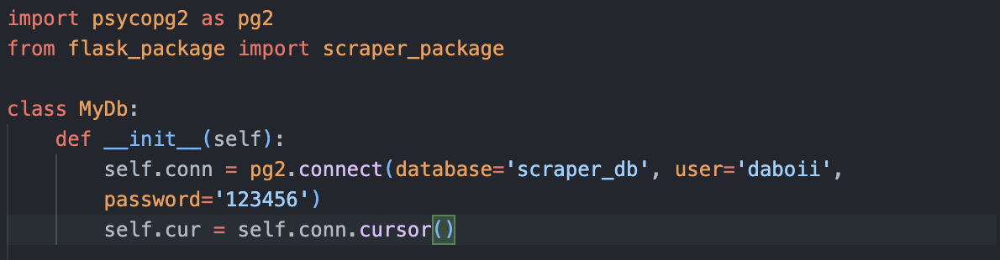

# Rest API Project
In this project i built a rest API with python and flask, I first scraped and cleaned country data online. Then stored the data in a PostgreSQL database, I've made the data available with an api. Using the api you can access countries info like: ``` name, capital, population, area size, country code and country iso code.```

Finally I made a country fun fact table where you can add a fun fact about any country using a ```POST```request, or edit/update the fun fact with a ```PUT``` request. 

By the way i did this project in fastapi [check it out](https://github.com/fulanii/fastapi-project)

- [Read More](https://fulanii.github.io/rest-api-project/)


<details>
    <summary> <h1> Project Demo  </h1> </summary>

GET endpoints
    

POST and PUT endpoints
    
</details>


# Run locally
Will be hosting this api online soon, in the meantime you can download it and run it locally by following the steps bellow.

1. Clone the repo: ```$ git clone https://github.com/fulanii/rest-api-project.git```

2. cd rest-api-project/project and ``` pip install requirements.txt```

3. connect to a postgres db (replace ```database, user, and password``` fields)
    

4. run server.py to create the tables, scrape and insert data

5. check out the project [Documentation](https://fulanii.github.io/rest-api-project/)

